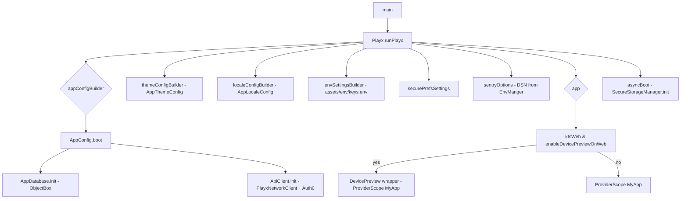
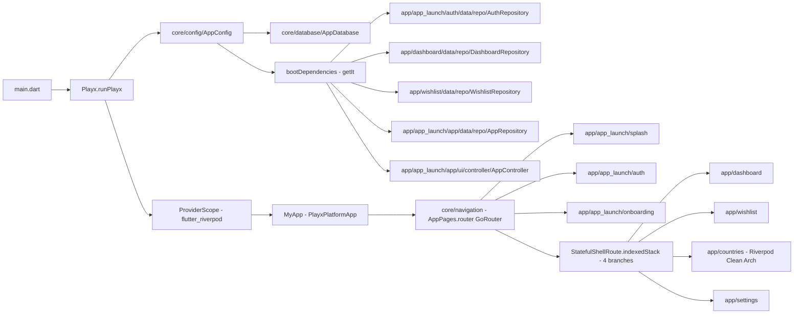

# Flutter Boilerplate — Architecture Reference

A thorough map of the `lib/` source tree, boot flow, state management, DI, and the tech stack of the Sourcya Flutter boilerplate at `/Users/omarsaeed/Desktop/Work/Sourcya/flutter-boilerplate`.

---

## 1. Stack Overview (`pubspec.yaml`)

`pubspec.yaml` declares the following key dependencies. Each tells us what subsystem is in use:

| Dependency | Purpose | Present? |
|---|---|---|
| `playx: ^2.1.2` (+ `playx_core` override) | Core architecture framework — theme, localization, env, network client, router wrapper, secure prefs | ✅ Yes |
| `flutter_riverpod: ^3.0.0` (+ `riverpod_annotation: ^3.0.0`, dev `riverpod_generator: ^3.0.0`) | State management & DI — `Notifier`, `AsyncNotifier`, `FutureProvider`, `ProviderScope`, `ConsumerWidget` | ✅ Yes |
| `go_router` (via `PlayxNavigationSettings.goRouter`) | Declarative router used by Playx | ✅ Yes (via Playx) |
| Dio (wrapped in `PlayxNetworkClient`) | HTTP networking | ✅ Yes (via Playx) |
| `auth0_flutter: ^2.4.0` | Auth0 authentication (mobile + web) | ✅ Yes |
| `objectbox: ^5.1.0` + `objectbox_flutter_libs` + `objectbox_generator` (dev) | Local NoSQL database with code-gen | ✅ Yes |
| `simple_secure_storage: ^0.3.7` + `encrypter_plus: ^5.1.0` | Hardware-backed secure storage with AES-encrypted fallback | ✅ Yes |
| `playx_version_update: ^1.0.1` | In-app version update prompt | ✅ Yes |
| `sentry` (via Playx) | Crash reporting / observability | ✅ Yes |
| `device_preview: ^1.3.1` | Web-only device preview | ✅ Yes |
| UI helpers: `dots_indicator`, `dropdown_button2`, `flutter_staggered_grid_view`, `pinput`, `skeletonizer`, `share_plus`, `url_launcher`, `carousel_slider`, `data_table_2`, `grouped_list`, `haptic_feedback`, `sliver_tools`, `flutter_advanced_drawer`, `infinite_scroll_pagination` | Reusable UI primitives | ✅ Yes |
| `build_runner`, `flutter_launcher_icons`, `flutter_project_name_changer`, `package_rename`, `lint` (dev) | Tooling | ✅ Yes |
| `freezed: ^3.2.0`, `json_serializable: ^6.10.0` (dev) | Codegen deps added but **not yet used** — all models still hand-written | ✅ Yes (dev, dormant) |

**Notable absences:** No `injectable` — DI is via Riverpod providers (`lib/core/providers.dart`). `freezed`/`json_serializable` are declared but **not yet activated**; all models still use hand-written `fromJson`/`toJson` (see the Model authoring rule below). The legacy `getIt` container and `PlayxBinding` classes have been **removed** as part of the Riverpod migration.

> **Model authoring rule (MANDATORY):** Do **NOT** use `freezed` or `json_serializable` for any model (DTO, domain/UI, or DB entity) in this codebase. Write models by hand following the pattern established in `lib/app/app_launch/auth/data/models/api/`:
> - Each model is a plain Dart class with `final` fields + a standard constructor.
> - Provide a `factory Model.fromJson(dynamic json, {...})` and a `Map<String, dynamic> toJson()`.
> - Use the `asTypeOrNull(map, key)` helpers (e.g. `asStringOrNull`, `asIntOrNull`, `asBoolOrNull`, `asMap`) from the project's utils for safe JSON parsing instead of generated accessors.
> - Group all related models for a feature under one barrel `models.dart` and expose them via `part`/`part of` (one `models.dart` per feature), mirroring `auth/data/models/models.dart`.
> - Split by layer: `api/` (network DTOs), `ui/` (domain/UI models), `mapper/` (API → UI mappers), and `db/` (ObjectBox entities, where applicable).
> - The `countries` feature (`lib/app/countries/data/model/`) has been migrated to this hand-written style — it now ships a single `models.dart` barrel with `part`/`part of` files (`api/country_api_model.dart`, `ui/country_ui_model.dart`, `mapper/country_mapper.dart`) and uses the `asTypeOrNull` helpers. It is the second reference implementation alongside `auth`.

### Scripts (`rps`)
- `setup` — pub get → package rename → project name change → launcher icons → keystore generation
- `gen` — `dart run build_runner build --delete-conflicting-outputs` (ObjectBox code-gen only)
- `watch` — `build_runner watch`
- `clean`, `format`, `icons`, `rename`

---

## 2. `lib/main.dart` — App Bootstrap Flow



`main()` calls `Playx.runPlayx(...)` with:
- `appConfigBuilder: () => AppConfig()` → `AppConfig.boot()` runs `AppDatabase.init()` then `ApiClient.init()` (registers the static `PlayxNetworkClient` + `Auth0`/`Auth0Web` singletons). **No `bootDependencies()`/`getIt` registration** — feature/repository DI is now Riverpod-based in `lib/core/providers.dart` (see §4.9) and consumed under the `ProviderScope`.
- `themeConfigBuilder: () => AppThemeConfig.createThemeConfig()` → light + dark themes.
- `localeConfigBuilder: () => AppLocaleConfig.createLocaleConfig()` → English (Poppins) + Arabic (Cairo).
- `envSettingsBuilder` → loads `assets/env/keys.env` via `PlayxEnv`.
- `securePrefsSettings` → `createSecurePrefs: false` (custom `SecureStorageManager` is used instead).
- `sentryOptions` → DSN pulled from `EnvManger.instance.sentryKey`; `tracesSampleRate: 1.0`, screenshots + failed request capture on.
- `app` → `ProviderScope(child: ...)` wrapping `MyApp`; on web when `enableDevicePreviewOnWeb` it is `DevicePreview(builder: (_) => const ProviderScope(child: MyApp()))`, else `const ProviderScope(child: MyApp())`. The `ProviderScope` is required because all feature views are `ConsumerWidget`s.

`MyApp` builds a `PlayxPlatformApp` with:
- `PlayxThemeSettings` (font family resolved per locale).
- `PlayxNavigationSettings.goRouter(goRouter: AppPages.router, ...)` — GoRouter wired through Playx, with optional `DevicePreview.appBuilder`.
- `PlayxScreenSettings` — ScreenUtilInit: `designSize: Size(430, 932)`, `fontSizeResolver: FontSizeResolvers.radius`.
- `PlayxAppSettings` — title from `AppTrans.appName.tr()`, custom `DefaultAppScrollBehavior`.

---

## 3. `lib/app/` — Feature Folders

Each feature follows a **feature-first layering** pattern:
Most features use `data/` (datasource + repository + models) + `ui/` (controller + view + widgets + imports). The **`countries/` feature** is the exception and uses Clean Architecture: `data/` + `domain/` (abstract repository + use cases) + `presentation/` (provider + view + widgets + imports) — see §3.5.

Naming conventions (post-Riverpod migration):
- **Views**: `*_view.dart` (`SplashView`, `LoginView`, `WishlistView`, `SettingsView`, `DashboardView`, `OnBoardingView`, `CountriesListView`, `CountryDetailsView`) — extend `ConsumerWidget` or `ConsumerStatefulWidget`.
- **Controllers / Notifiers**: `*_controller.dart` (legacy features) or `*_notifier.dart` (countries), extending `Notifier<T>` / `AsyncNotifier<T>`. Exposed via `*Provider` (`NotifierProvider`/`FutureProvider`). The old `GetxController`/`SuperController`/`FullLifeCycleController` and `PlayxBinding` classes are gone.
- **Widgets**: `build_*.dart` files (legacy features) or `*_widget.dart` / `country_list_item.dart`-style files (countries) — plain `StatelessWidget`/`ConsumerWidget`s, no longer `GetView<T>`.
- **Barrel imports**: `ui/imports/*_imports.dart` (legacy) or `presentation/*/imports/*_imports.dart` (countries) aggregate the feature's exports via `part`/`part of`.
- **Model split**: `data/model/api/` (network DTOs), `data/model/ui/` (domain models), `data/model/mapper/` (API → UI mappers), and (wishlist only) `data/model/db/` (ObjectBox entities). All models are **hand-written** — `freezed`/`json_serializable` are declared but not yet activated (see the **Model authoring rule** above; reference implementations: `lib/app/app_launch/auth/data/models/api/` and `lib/app/countries/data/model/`).

### 3.1 `app_launch/` — Pre-home flow + app shell

Four sub-features: `splash/`, `onboarding/`, `auth/`, `app/`.

#### `splash/`
- `splash/ui/views/splash_view.dart` — `SplashView extends GetView<SplashController>`.
- `splash/ui/controllers/splash_controller.dart` — `SplashController extends FullLifeCycleController`:
  - waits for splash animation, awaits `Playx.asyncBootFuture()` (secure storage init),
  - reads `MyPreferenceManger.isOnBoardingShown` → routes to onboarding,
  - checks `ApiHelper.instance.isLoggedIn(checkAuth0: false)` → routes to login or home.
  - `handleAppUpdate()` (commented) wired to `PlayxVersionUpdate`.
- `splash/ui/bindings/splash_binding.dart` — `SplashBinding extends PlayxBinding`.
- `splash/ui/views/widgets/` — `build_splash_app_version_widget.dart`, `build_splash_logo_widget.dart`, `build_splash_app_title_widget.dart`.
- `splash/ui/imports/splash_imports.dart` — barrel.

#### `onboarding/`
- `onboarding/ui/view/onboarding_view.dart` — `OnBoardingView extends GetView<OnBoardingController>`.
- `onboarding/ui/controller/onboarding_controller.dart` — `OnBoardingController extends GetxController`. Manages `PageController`, `currentIndex`, `isCompleted`; on finish calls `MyPreferenceManger.saveOnBoardingShown()` then navigates to login.
- `onboarding/ui/binding/onboarding_binding.dart` — `OnBoardingBinding`.
- `onboarding/ui/view/widgets/` — `build_onboarding_page_view_widget.dart`, `build_onboarding_page_skip_widget.dart`, `build_onboarding_page_indicators_widget.dart`, and `page/onboarding_page.dart` (single page renderer).
- `onboarding/data/model/onboarding.dart` — `OnBoarding` model (title, subtitle, lottie asset).

#### `auth/`
Most complete feature. Layered `data/` + `ui/`.

**Data layer**
- `auth/data/repo/auth_repository.dart` — `AuthRepository` orchestrates `RemoteAuthDataSource` + `Auth0AuthDataSource` + `MyPreferenceManger`. Methods: `loginViaAuth0`, `loginViaEmailAndPassword`, `register`, `otpLogin`, `verifyOtpCode`, `saveApiUser`, `saveUser`, `saveUser`, `handleSignOut` (referenced by `AppController`). Returns `NetworkResult<User>`. `static AuthRepository get instance => getIt.get<AuthRepository>()`.
- `auth/data/data_sources/remote_auth_data_source.dart` — `RemoteAuthDataSource` uses `PlayxNetworkClient` against `Endpoints.login/register`. Returns `NetworkResult<ApiUser>`.
- `auth/data/data_sources/test_auth_data_source.dart` — `TestAuthDataSource extends RemoteAuthDataSource`. Mocks login/otp/verify with `Future.delayed` + canned `ApiUser`. **Currently wired as the active data source** in `AppConfig.bootDependencies()` (`TestAuthDataSource(client: apiClient)`).
- `auth/data/data_sources/auth0_auth_data_source.dart` — `Auth0AuthDataSource` wraps `Auth0`/`Auth0Web` for social login, credentials, logout.
- `auth/data/models/models.dart` — barrel with `part` directives for:
  - `api/api_user.dart` (`ApiUser`), `api/api_user_info.dart` (`ApiUserInfo`), `api/api_profile.dart` (`ApiProfile`), `api/role.dart` (`ApiRole`), `api/auth0Exception.dart`.
  - `ui/user.dart` (`User`), `ui/user_info.dart` (`UserInfo`), `ui/profile_info.dart`, `ui/role.dart`, `ui/user_role_type.dart` (`UserRoleType`), `ui/login_method.dart` (`LoginMethod` enum: email/auth0Web/google/apple).
  - `mapper/api_user_to_user_mapper.dart`, `api_user_info_to_user_info_mapper.dart`, `api_profile_to_profile_mapper.dart`, `api_role_to_role.dart`.

**UI layer** — three auth flows, each with its own binding/controller/view/widgets/imports:
- `auth/ui/login/` — `LoginController extends GetxController` + `LoginView extends GetView<LoginController>` + widgets: `build_login_email_field`, `build_login_password_field`, `build_login_button`, `build_login_title`, `build_login_register_now`, `build_login_with_email_widget`, `build_choose_login_method_widget`, `build_login_method_button`, `build_login_lottie_animation`.
- `auth/ui/register/` — `RegisterController` + `RegisterView` + many `build_register_*` widgets (name/email/password/confirm/terms/method buttons/lottie/etc.).
- `auth/ui/otp_login/` — `OtpLoginController` + `OtpLoginView` + phone-number entry widgets (`build_login_mobile_text_field`, `build_login_button`, `build_login_subtitle_text`, `build_login_text`, `build_login_lottie_animation`).
- `auth/ui/verify_phone/` — `VerifyPhoneController` + `VerifyPhoneView` + OTP verification widgets (`build_verify_otp_field`, `build_verify_button`, `build_verify_phone_text`, `build_verify_subtitle_text`, `build_verify_code_not_received_widget`, `build_verify_lottie_animation`).
- Each folder has `bindings/` (`*_binding.dart` extending `PlayxBinding`) and `imports/` (`*_imports.dart`).

#### `app/` — App shell (drawer + bottom nav)
- `app/data/model/custom_navigation_destination_item.dart` — nav item model (icon, label, navigationIndex, route).
- `app/data/datasource/app_datasource.dart` — `AppDatasource` (drawer items source).
- `app/data/repository/app_repository.dart` — `AppRepository` exposes `mainDrawerItems`, `otherDrawerItems` (dashboard, wishlist, settings, support, logout). `static AppRepository get instance => getIt.get<AppRepository>()`.
- `app/ui/controller/app_controller.dart` — `AppController extends SuperController` (full lifecycle). Holds `currentUser` (Rxn), `currentDrawerIndex`, `bottomNavItems`, `AdvancedDrawerController`, `loadingStatus`. Handles `logout()` (confirms via `showConfirmDialog`, calls `AuthRepository.handleSignOut`, navigates to login), drawer open/close, `handleDrawerMainItemClicked` (uses `PlayxNavigation.goToBranch`).
- `app/ui/view/app_view.dart` — `AppView extends GetView<AppController>` (the shell rendering the `StatefulShellRoute`).
- `app/ui/view/navigation/`:
  - `custom_navigation_bar.dart` + `widgets/custom_navigation_bar.dart`, `widgets/custom_platform_nav_bar.dart`, `widgets/build_bottom_nav_profile_image_widget.dart`.
  - `drawer/` — `custom_drawer.dart` + `widgets/advanced_custom_drawer.dart` (uses `flutter_advanced_drawer`), `widgets/drawer_body.dart`, `widgets/build_drawer_item_widget.dart`.
- `app/ui/imports/app_imports.dart` — barrel.

### 3.2 `dashboard/`
- `dashboard/data/model/dashboard.dart` — `DashboardItem` model (id, name, imageUrl, description, isFavorite).
- `dashboard/data/datasource/dashboard_datasource.dart` — `DashboardDatasource` (currently a stub).
- `dashboard/data/repository/dashboard_repository.dart` — `DashboardRepository` (empty class scaffold, holds `_dataSource`).
- `dashboard/ui/controller/dashboard_controller.dart` — `DashboardController extends GetxController`. Generates 20 placeholder items, exposes `dataState = Rx<DataState<List<DashboardItem>>>`, queries `WishlistRepository.getAllWishlistItems()` to mark favorites, `onFavoriteChanged` inserts/deletes via `WishlistRepository`.
- `dashboard/ui/view/dashboard_view.dart` — `DashboardView extends GetView<DashboardController>`.
- `dashboard/ui/view/widgets/build_dashboard_view.dart` — grid layout rendering `DashboardItem`s with favorite toggle.
- `dashboard/ui/binding/dashboard_binding.dart` — `DashboardBinding extends PlayxBinding`; puts `DashboardController(wishlistRepository: WishlistRepository.instance)`.
- `dashboard/ui/imports/dashboard_imports.dart` — barrel.

### 3.3 `wishlist/`
Most complete **local-first** feature (no remote).
- `wishlist/data/model/db/database_wishlist_item.dart` — `@Entity() class DatabaseWishlistItem` for ObjectBox (`@Id(assignable: true) int id; String? name; String? imageUrl; @Property(type: PropertyType.date) DateTime? date;`).
- `wishlist/data/datasource/db/dao/wishlist_dao.dart` — `WishlistDao` wraps `Box<DatabaseWishlistItem>`: `getAllWishlistItems`, `watchAllWishlistItems` (reactive stream), `insertWishlistItem(s)`, `deleteWishlistItem`, `deleteAllWishlistItems`.
- `wishlist/data/datasource/db/local_wishlist_data_source.dart` — `LocalWishlistDataSource` (DAO wrapper; registered as singleton). `static LocalWishlistDataSource get instance => getIt.get<LocalWishlistDataSource>()`.
- `wishlist/data/datasource/remote/remote_wishlist_data_source.dart` — `RemoteWishlistDataSource` (scaffold, not currently used).
- `wishlist/data/model/ui/wishlist.dart` — `WishlistItem` UI model + `toDatabaseWishlistItem()`.
- `wishlist/data/model/mapper/database_wishlist_to_wishlist_item_mapper.dart` — DB ↔ UI mapper.
- `wishlist/data/repository/wishlist_repository.dart` — `WishlistRepository` wraps `LocalWishlistDataSource`, exposes UI-mapped `getAllWishlistItems`, reactive `watchAllWishlistItems()`, `insertWishlistItem`, `deleteWishlistItem`. `static WishlistRepository get instance => getIt.get<WishlistRepository>()`.
- `wishlist/ui/controller/wishlist_controller.dart` — `WishlistController extends GetxController`. Subscribes to `WishlistRepository.watchAllWishlistItems()` stream, drives `dataState = Rx<DataState<List<WishlistItem>>>`. Cancels subscription in `onClose`.
- `wishlist/ui/view/wishlist_view.dart` — `WishlistView extends GetView<WishlistController>`.
- `wishlist/ui/view/widgets/build_wishlist_view.dart` — list rendering.
- `wishlist/ui/binding/wishlist_binding.dart` — `WishlistBinding` puts `WishlistController(repository: WishlistRepository.instance)`.
- `wishlist/ui/binding/wishlist_details_binding.dart` — `WishlistDetailsBinding` (route exists but view is a placeholder `Scaffold(body: Text('Wishlist Details'))`).
- `wishlist/ui/imports/wishlist_imports.dart` — barrel.

### 3.4 `settings/`
- `settings/data/model/settings.dart` — settings model.
- `settings/data/datasource/settings_datasource.dart` — `SettingsDatasource` (stub).
- `settings/data/repository/settings_repository.dart` — `SettingsRepository` (empty scaffold).
- `settings/ui/controller/settings_controller.dart` — `SettingsController extends GetxController`. Manages `currentLocale` (Rxn<XLocale>), `currentTheme` (Rx<XTheme>). Handles language/theme selection via `PlayxLocalization.updateTo` / `PlayxTheme.updateTo(theme, animation: PlayxThemeClipperAnimation())`. Drives a multi-page Wolt-style `CustomModal` (`showSettingsModalSheet`) with pages for language and theme. Logout delegated to `AppController.instance.logout()`.
- `settings/ui/view/settings_view.dart` — `SettingsView extends GetView<SettingsController>`.
- `settings/ui/view/widgets/common/` — `settings_page.dart`, `settings_tile.dart`, `settings_dialog.dart` (reusable settings scaffolding).
- `settings/ui/view/widgets/` — `build_settings_language_widget.dart`, `build_settings_theme_widget.dart`, `build_settings_logout_widget.dart`.
- `settings/ui/binding/settings_binding.dart` — `SettingsBinding`.
- `settings/ui/imports/settings_imports.dart` — barrel.

### 3.5 `countries/` — Riverpod Clean-Architecture reference (NEW)

**This is the only feature using Riverpod + Clean Architecture (`data` + `domain` + `presentation`).** It is the modern reference template for new features and intentionally diverges from the `data/` + `ui/` layering used by the legacy features above. There is **no ObjectBox / local DB** — it is purely remote against the REST Countries v5 API.

```
lib/app/countries/
├── data/
│   ├── datasource/countries_remote_data_source.dart
│   ├── model/
│   │   ├── api/country_api_model.dart
│   │   ├── mapper/country_mapper.dart
│   │   ├── ui/country_ui_model.dart
│   │   └── models.dart                       ← barrel (part/part-of)
│   └── repository/countries_repository_impl.dart
├── domain/
│   ├── repository/countries_repository.dart  ← abstract interface
│   └── usecase/
│       ├── get_countries_usecase.dart
│       └── get_country_details_usecase.dart
└── presentation/
    ├── countries/
    │   ├── imports/countries_imports.dart    ← barrel (part/part-of)
    │   ├── provider/{countries_notifier,countries_provider}.dart
    │   ├── view/countries_list_view.dart
    │   └── widgets/{countries_error_widget,country_list_item}.dart
    └── country_details/
        ├── imports/country_details_imports.dart ← barrel (imports countries_imports.dart)
        ├── provider/country_details_provider.dart
        ├── view/country_details_view.dart
        └── widgets/{countries_error_widget,country_details_card}.dart
```

**Data layer**
- `data/model/models.dart` — barrel with `part` directives for `api/`, `ui/`, `mapper/`. Helpers (`asMap`, `asString`, `asStringOrNull`, `asIntOrNull`, `asListOrNull`, `asListStringOrNull`) come from `package:playx/playx.dart`.
- `data/model/api/country_api_model.dart` — hand-written DTOs (no freezed/json_serializable): `CountryApiModel` (`names`, `codes`, `capitals`, `region/subregion`, `population`, `flag`, `languages`, `currencies`, `timezones`, `callingCodes`) + nested `CountryNameApiModel`, `CountryCodesApiModel` (JSON keys `alpha_2`/`alpha_3`/`ccn3`), `CapitalApiModel`, `CountryFlagApiModel` (`url_png`/`url_svg`). `factory fromJson(dynamic json)` + `toJson()` that omits nulls.
- `data/model/ui/country_ui_model.dart` — `CountryUiModel` plain immutable domain model (`name`, `officialName`, `code`, `capital`, `region`, `subregion`, `population`, `flagUrl`, `languages`, `currencies`, `timezones`, `callingCodes`). **No `fromJson`/`toJson`** — created only via the mapper.
- `data/model/mapper/country_mapper.dart` — `extension CountryMapper on CountryApiModel { CountryUiModel toUi() }` + `extension CountryListMapper on List<CountryApiModel> { List<CountryUiModel> toUi() }`.
- `data/datasource/countries_remote_data_source.dart` — `CountriesRemoteDataSource({required PlayxNetworkClient client})`. Methods return `Future<NetworkResult<...>>`: `getAllCountries()` (`_client.getList('', query: {'limit':'100'}, dataKey: 'data.objects')`), `searchCountriesByName(name)` (`/name`, `dataKey: 'data.objects'`), `getCountryByCode(code)` (`/codes.alpha_2/$code`, then `NetworkResult.map` to pick `.first`). The `dataKey: 'data.objects'` matches the REST Countries v5 envelope `{"data":{"objects":[...]}}`.
- `data/repository/countries_repository_impl.dart` — `CountriesRepositoryImpl implements CountriesRepository`, delegates to the data source and maps `CountryApiModel` → `CountryUiModel` via `.toUi()`. Private `_mapListResult` uses `NetworkResult.map` (type-transforming) to preserve errors.

**Domain layer** (unique to this feature)
- `domain/repository/countries_repository.dart` — `abstract class CountriesRepository` with `getAllCountries()`, `searchCountries(name)`, `getCountryByCode(code)` (all `Future<NetworkResult<...>>`).
- `domain/usecase/get_countries_usecase.dart` — `GetCountriesUseCase(repository)` thin pass-through; `call()` → `repository.getAllCountries()`.
- `domain/usecase/get_country_details_usecase.dart` — `GetCountryDetailsUseCase(repository)`; `call(code)` → `repository.getCountryByCode(code)`.

**Presentation — countries list**
- `presentation/countries/provider/countries_provider.dart` — Riverpod DI chain (all `FutureProvider`, awaited async): `countriesRemoteDataSourceProvider` → `countriesRepositoryProvider` → `getCountriesUseCaseProvider` + `getCountryDetailsUseCaseProvider`. The details feature reuses `getCountryDetailsUseCaseProvider` by importing `countries_imports.dart`.
- `presentation/countries/provider/countries_notifier.dart` — `class CountriesNotifier extends Notifier<AsyncValue<List<CountryUiModel>>>`. `build()` returns `AsyncValue.loading()` then `Future.microtask(loadCountries)`. `loadCountries()` / `searchCountries(query)` set loading → call use case/repo → `result.when(success:..., error:...)` (the void-callback `NetworkResult.when`). Exposed via `countriesNotifierProvider = NotifierProvider<CountriesNotifier, AsyncValue<List<CountryUiModel>>>`.
- `presentation/countries/view/countries_list_view.dart` — `CountriesListView extends ConsumerStatefulWidget`. `CustomScaffold(title: AppTrans.countries)`, search `TextField` → `ref.read(countriesNotifierProvider.notifier).searchCountries(value)`, `state.when(loading: CustomLoading, error: CountriesErrorWidget(onRetry), data: ListView.builder of CountryListItem)`, empty → `EmptyDataWidget(AppTrans.noCountriesFound)`, item tap → `AppNavigation.navigateToCountryDetails(code:)`.
- `presentation/countries/widgets/country_list_item.dart` — `CountryListItem extends StatelessWidget` (`InkWell` + `CustomCard`, flag via cached network image or fallback `Icon(Icons.flag)`, name/capital/region + chevron).
- `presentation/countries/widgets/countries_error_widget.dart` — `CountriesErrorWidget extends StatelessWidget` (error icon, message, `CustomElevatedButton` retry).
- `presentation/countries/imports/countries_imports.dart` — barrel (`part` directives for provider/view/widgets).

**Presentation — country details**
- `presentation/country_details/provider/country_details_provider.dart` — `countryDetailsProvider = FutureProvider.family<CountryUiModel, String>((ref, code) async { ... })`. Awaits `getCountryDetailsUseCaseProvider`, calls `useCase(code)`, throws on error so `AsyncValue.error` is set.
- `presentation/country_details/view/country_details_view.dart` — `CountryDetailsView extends ConsumerWidget` (`{required String code}`). Watches `countryDetailsProvider(code)`, renders `CustomScaffold(title: AppTrans.countryDetails)` + `asyncCountry.when(loading: CustomLoading, error: CountriesErrorWidget(onRetry: ref.invalidate), data: CountryDetailsCard)`.
- `presentation/country_details/widgets/country_details_card.dart` — `CountryDetailsCard extends StatelessWidget` + private `_DetailRow`. Renders flag, name, officialName, and detail rows for code/capital/region/subregion/population/timezones/languages/currencies.
- `presentation/country_details/widgets/countries_error_widget.dart` — duplicate of the list feature's `CountriesErrorWidget` (same class/body, duplicated per sub-feature — candidate for extraction into `core/ui`).
- `presentation/country_details/imports/country_details_imports.dart` — barrel; imports `countries_imports.dart` to reuse `getCountryDetailsUseCaseProvider`.

**App wiring**
- Routes: `Routes.countries` / `Paths.countries = '/countries'`, `Routes.countryDetails` / `Paths.countryDetails = 'details/:code'` (nested under `/countries`).
- `AppPages.router`: `countries` is its own `StatefulShellBranch` (the 3rd bottom-nav tab) with `CountriesListView` as the branch root and `CountryDetailsView(code:)` as a nested `GoRoute` (`/countries/details/:code`).
- `AppNavigation.navigateToCountryDetails({required String code})` → `_router.pushNamed(Routes.countryDetails, pathParameters: {'code': code})`.
- Drawer / bottom nav: `AppRepository.mainDrawerItems` and `AppController`'s `bottomNavItems` both include a Countries entry (`navigationIndex: 2`, `IconInfo.icon(Icons.public)`, `label: AppTrans.countries`).
- DI: **not registered in `AppConfig.bootDependencies()`** (which no longer exists). The feature's network client comes from `restCountriesClientProvider` in `lib/core/providers.dart` (a dedicated `PlayxNetworkClient` with `baseUrl: Endpoints.restCountriesBaseUrl` and `Authorization: Bearer ${Constants.restCountriesApiKey}` header — separate from the user-auth `networkClientProvider`). The full provider chain (`restCountriesClientProvider` → `countriesRemoteDataSourceProvider` → `countriesRepositoryProvider` → use cases) lives in the feature's `provider/` files.
- Translation keys: `AppTrans.countries`, `AppTrans.countryDetails`, `AppTrans.searchCountries`, `AppTrans.noCountriesFound` (in `lib/core/ui/translation/app_translations.dart`).

> **Latent bug:** `country_mapper.dart`'s `capitals?.firstWhere((c) => c.name != null)` has no `orElse` and will throw `StateError` if every capital has a null `name`.

---

## 4. `lib/core/` — Infrastructure

```
lib/core/
├── config/        (app_config.dart, constant.dart)
├── database/      (app_database.dart, generated/objectbox.g.dart)
├── models/        (models.dart, src/{result,data_wrapper,page_info,media_item,icon_info,mapper/api_response_to_data_wrapper})
├── navigation/    (navigation.dart, src/{app_routes,app_pages,app_navigation,navigation_utils})
├── network/       (network.dart, src/{api_client,endpoints/endpoints,helper/api_helper,exception/custom_exception_message,models/{api_response,api_meta}})
├── preferences/   (env_manger.dart, preference_manger.dart, secure_storage_manager.dart)
├── ui/            (large UI library — see §4.7)
└── utils/         (app_utils.dart, are_equals_validation.dart, pick.dart, web/*)
```

### 4.1 `config/`
- `app_config.dart` — `AppConfig extends PlayXAppConfig`. Post-migration this is **no longer the DI hub**:
  - `boot()` → `WidgetsFlutterBinding.ensureInitialized()`, `PlayxLogger.initLogger(name: 'MY APP')` → `myLogger` (global), `AppDatabase.init()`, then `ApiClient.init()`.
  - **`bootDependencies()` has been removed.** All feature/repository DI now lives in `lib/core/providers.dart` as Riverpod providers (see §4.9). `getIt` is no longer used.
  - `asyncBoot()` → `SecureStorageManager.init()`.
  - Static singletons still initialised here for non-injected infra: `MyPreferenceManger.instance`, `EnvManger.instance`, `SecureStorageManager.instance`, `ApiClient.client`/`auth0`/`auth0Web`, `ApiHelper.instance`.
- `constant.dart` — `Constants` abstract: Auth0 client IDs/domain (populated at runtime), store URLs/IDs for version update, Google sign-in server ID, WhatsApp number, biometric flags, `storeCountry = 'sa'`, and **`restCountriesApiKey`** (REST Countries v5 bearer token; demo value `'rc_live_demo'` — sign up at restcountries.com to replace).

### 4.2 `database/` (ObjectBox)
- `app_database.dart` — `AppDatabase`. Singleton-ish; `create()` resolves a store at `<docs>/app_database` (reuses with `Store.attach` if already open, else `openStore`). `init()` registers `AppDatabase` + `LocalWishlistDataSource` singletons in `getIt`. In debug mode, `runTestWebApp()` opens the ObjectBox `Admin` (data browser). Exposes `wishlistDao` over `Box<DatabaseWishlistItem>`.
- `generated/objectbox.g.dart` — code-generated ObjectBox bindings (produced by `dart run build_runner build`).

### 4.3 `models/`
- `models.dart` — barrel (`part` directives).
- `src/result.dart` — custom `sealed class Result<T>` with `ResultSuccess<T>` / `ResultError<T>` + `ResultException(message, statusCode)`. Provides `when`, `map`, `mapAsync`, `mapDataAsync`, `mapDataAsyncInIsolate` (isolate-based JSON mapping via `MapUtils`). Used by the **data layer** (e.g., `LocalWishlistDataSource`).
- `src/data_wrapper.dart`, `src/page_info.dart`, `src/media_item.dart` (`MediaItem` image model with `toFormData`), `src/icon_info.dart` (`IconInfo` — icon/svg abstraction).
- `src/mapper/api_response_to_data_wrapper.dart` — converts `ApiResponse` → `DataWrapper`.

### 4.4 `navigation/` (GoRouter via Playx)
- `navigation.dart` — barrel (`part` directives).
- `src/app_routes.dart` — `Routes` (names) + `Paths` (paths). `splash='/'`, `login`, `register`, `onboarding`, `verifyPhone='/otp'`, `dashboard`, `wishlist`, `countries`, `countryDetails='details/:code'` (nested under `/countries`), `settings`, `wishlistDetails='details'`. `AppPages.homeRoute = Routes.dashboard`.
- `src/app_pages.dart` — `AppPages.router` is a `GoRouter` with `debugLogDiagnostics: true` and `SentryNavigatorObserver`. Uses `StatefulShellRoute.indexedStack` for the bottom-nav shell with **four branches** (dashboard, wishlist, **countries**, settings). Post-migration routes use plain `GoRoute`s with `builder:` closures (not `PlayxRoute` with `binding:`) — per-route DI is via Riverpod providers consumed inside the views, not via `PlayxBinding`. `countries/details/:code` is a nested `GoRoute` reading `state.pathParameters['code']`. Top-level routes: `splash`, `login`, `register`, `onboarding`, plus the shell.
- `src/app_navigation.dart` — `AppNavigation` (abstract): named navigation helpers (`navigateFormSplashToHome`, `navigateFormSplashToLogin`, `navigateFromLoginToRegister`, `navigateFromOnBoardingToLogin`, `navigateFromLoginToVerifyPhone`, `navigateToSplash`, `navigateToLogin`, `navigateToCountryDetails({required String code})` → `_router.pushNamed(Routes.countryDetails, pathParameters: {'code': code})`, etc.). All use `PlayxNavigation.offAllNamed` / `toNamed` or the underlying `_router`.
- `src/navigation_utils.dart` — `NavigationUtils`: `routesBottomNav`, `showBottomNav`, `canShowDrawer = AppUtils.isMobile()`, `navigatorKey` (GoRouter's navigator key), `navigationContext`.

**Routing summary:** Yes — it's **GoRouter**, accessed through Playx via `PlayxNavigationSettings.goRouter`. `PlayxRoute`/`PlayxBinding` are no longer used for per-route DI; Riverpod providers replace them.

### 4.5 `network/` (Dio via Playx)
- `network.dart` — barrel.
- `src/api_client.dart` — `ApiClient` (abstract, singleton-style accessors):
  - `createApiClient()` builds a `Dio` with `baseUrl: Endpoints.baseUrl`, `validateStatus: (_) => true`, 30s timeouts, JSON content type, calls `dio.addSentry()`. Wraps it in a `PlayxNetworkClient` with a `customHeaders()` that injects `Authorization: Bearer <token>` from `MyPreferenceManger.instance.token`, and a `CustomExceptionMessage` for localized error strings.
  - `init()` registers `PlayxNetworkClient`, `Auth0`, `Auth0Web` in `getIt`.
  - `apiToken` getter lazily reads token; `_signOut()` clears prefs and navigates to splash (commented out as interceptor callback).
- `src/endpoints/endpoints.dart` — `Endpoints.baseUrl = "https://sourcya-connect.herokuapp.com"`, paths for `login`, `register`, `profile`, `updateUser`, `upload`, `loginViaAuth0`.
- `src/helper/api_helper.dart` — `ApiHelper` (singleton): `isLoggedIn` (checks prefs + Auth0 credentials), `logout`, `profileImageUrl` (from Auth0 credentials), `uploadImage` (multipart POST), `updateUser`, `updateProfileName`. Used by `SplashController` and auth flows.
- `src/exception/custom_exception_message.dart` — `CustomExceptionMessage extends ExceptionMessage` localizing every Dio error type via `AppTrans.*`.
- `src/models/api_response.dart` — `ApiResponse<T>` + `ApiMeta` (data + meta envelope). `fromJson`, `createApiResponseFromJsonDataList`, `toJson*` variants.
- `src/models/api_meta.dart` — pagination/meta model.

**Network summary:** Yes — **Dio** wrapped in Playx's `PlayxNetworkClient`; Auth0 configured for social login; Sentry wired via `dio.addSentry()`.

### 4.6 `preferences/`
- `env_manger.dart` — `EnvManger` reads env vars through `PlayxEnv` (loaded from `assets/env/keys.env` by `main.dart`). Exposes `sentryKey`, `showVersionCode`. Singleton via `getIt`.
- `preference_manger.dart` — `MyPreferenceManger` (note the intentional "Manger" spelling). Persists (all via `SecureStorageManager`, not plain SharedPreferences except onboarding flag):
  - `token`, `logged_in_user` (JSON-encoded `ApiUserInfo`), `login_method` (`LoginMethod` enum), `user_role_type` (`UserRoleType`).
  - `isLoggedIn`/`isLoggedOut`, `loginMethod`, `saveLoginMethod`, `token`/`saveToken`, `userRoleType`/`saveUserRoleType`, `saveUser`/`getSavedUser`, `signOut`.
  - `isOnBoardingShown` / `saveOnBoardingShown()` use `PlayxPrefs` (plain prefs).
  - Wraps secure reads in try/catch to swallow `BadPaddingException` (flutter_secure_storage issue #210).
- `secure_storage_manager.dart` — `SecureStorageManager`. Sophisticated AES-encrypted storage:
  - `StorageType` enum: `simple` (Keystore/Keychain), `asyncPrefs` (AES-encrypted SharedPreferences fallback), `auto` (default; tries simple, falls back).
  - On `init()`: initializes `simple_secure_storage`, generates/loads random 32-byte AES key + 16-byte web password/salt, runs a health check, builds an `encrypt.Encrypter(AES)`. Falls back to hardcoded keys if device keystore fails (reports to Sentry).
  - `_ensureFreshInstallHandled()` for first-run handling.
  - Provides `getSecureString`, `setSecureString`, `remove` (the rest of the file continues past what was inspected).

### 4.7 `ui/` (large shared widget + design system library)
```
ui/
├── ui.dart                    (barrel)
├── alerts/alert.dart
├── data_state/
│   ├── models/{data_state,data_error,network_bound_resource,rx_data_state}.dart
│   ├── widgets/{data_state_widget,rx_data_state_widget}.dart
│   └── sliver/{data_state_widget,rx_data_state_widget}.dart
├── resources/
│   ├── assets/{assets,animations,images}.dart
│   ├── dimens/{dimens,mobile_dimens,small_mobile_dimens,tablet_dimens}.dart
│   └── style/{style,app_text_style}.dart
├── theme/
│   ├── theme.dart             (AppThemeConfig)
│   ├── light_theme.dart, dark_theme.dart
│   └── colors/{app_colors,light_colors,dark_colors}.dart
├── translation/
│   ├── app_translations.dart  (AppTrans keys)
│   └── app_locale_config.dart (AppLocaleConfig + fontFamily helpers)
└── widgets/
    ├── components/   (custom_scaffold, custom_app_bar, custom_card, custom_dialog,
    │                  custom_drop_down, custom_elevated_button, custom_ink_well,
    │                  custom_page, custom_search_icon_button, custom_text,
    │                  custom_text_button, custom_type_chip, feature_chip,
    │                  filter_chip_selector, filter_multiple_chip_selector,
    │                  input_field_widget, input_toggle_field_widget,
    │                  menu_icon_button, stroke_text, support_button, toggle_switch,
    │                  text_field)
    ├── bottom_sheet/ (custom_modal.dart + models/custom_dialog_modal.dart + widgets/build_modal_*.dart)
    ├── state/        (custom_loading, loading_overlay, empty_data_widget,
    │                  error_widget, no_internet_widget, connection_status_widget,
    │                  model/loading_status.dart)
    ├── table/        (column_header, cell_text, info_item,
    │                  custom_table_view, custom_paginated_table_view)
    ├── responsive/   (responsive_navigation_config.dart + widgets/{custom_responsive_builder,
    │                  custom_responsive_card, animated_widget_wrapper})
    ├── view/         (content_landscape_page_view, content_tabbed_page_view,
    │                  generic_paged_landscape_view, side_panel_layout_view,
    │                  controller/{base_paged_controller, base_paged_tabbed_controller}
    │                  — both extend GetxController)
    ├── counter_widget.dart, place_holder_image.dart, paged_grouped_list_view.dart,
    │   paged_grouped_grid_view.dart, sliver_grouped_grid_view.dart,
    │   custom_sliver_pagination_list.dart, custom_orienation_widget.dart,
    │   view_toggle.dart, keyboard_visibility_padding.dart
```

Key concepts:
- **`DataState<T>`** (`ui/data_state/models/data_state.dart`) — sealed class `Initial/Loading/Success/Failure/NetworkFailure`. `fromNetworkResult`, `fromNetworkError`, `fromEmptyError` factories. This is the UI-facing state wrapper consumed by controllers (e.g., `DashboardController`, `WishlistController` use `Rx<DataState<List<...>>>`). Widgets: `DataStateWidget` and `RxDataStateWidget` (regular + sliver variants) render loading/empty/error/success.
- **`AppTrans`** (`ui/translation/app_translations.dart`) — static keys (e.g., `appName`, `loginText`, `badRequest`, `noInternetMessage`, `updateTitle`, `language`, `theme`, `home`, `settings`). Used as `.tr()` strings throughout the app and inside `CustomExceptionMessage`. Translation JSON lives at `assets/translations/{ar,en}.json`.
- **`AppLocaleConfig`** (`ui/translation/app_locale_config.dart`) — two `XLocale`s: English (Poppins) + Arabic (Cairo); helpers `fontFamily({context})` and `fontFamilyBasedOnText`.
- **`AppThemeConfig`** (`ui/theme/theme.dart`) — `PlayxThemeConfig` with `LightTheme.theme` + `DarkTheme.theme`, initial index from `PlayxTheme.isDeviceInDarkMode()`. Colors split into `light_colors.dart` / `dark_colors.dart` via `AppColors`.
- **Design tokens**: `resources/dimens/` (mobile / small_mobile / tablet), `resources/style/app_text_style.dart`, `resources/assets/{assets,animations,images}.dart` (typed asset references, e.g., `Assets.animations.logout`).
- **Reusable widgets**: `components/custom_scaffold.dart`, `custom_app_bar.dart`, `custom_card.dart`, `custom_dialog.dart`, `custom_elevated_button.dart`, `custom_text_button.dart`, `custom_drop_down.dart`, `text_field.dart`, `input_field_widget.dart`, `toggle_switch.dart`, chip selectors, etc. State widgets under `widgets/state/` (`custom_loading.dart`, `loading_overlay.dart`, `empty_data_widget.dart`, `no_internet_widget.dart`, `connection_status_widget.dart`, `error_widget.dart`, `model/loading_status.dart`).

### 4.8 `utils/`
- `app_utils.dart` — `AppUtils` helpers (e.g., `isMobile()`), orientation/platform detection.
- `are_equals_validation.dart` — equality/validation helpers.
- `pick.dart` — image/file picker helpers.
- `web/browser_url_updater.dart` + `browser_url_updater_web.dart` + `browser_url_updater_stub.dart` — conditional web-only URL sync (uses conditional imports).

### 4.9 `providers.dart` (Riverpod DI hub — NEW)
- `lib/core/providers.dart` is the post-migration DI hub, replacing the old `AppConfig.bootDependencies()` / `getIt` setup. All infrastructure and repository wiring lives here as Riverpod providers.
- **Infrastructure providers:** `secureStorageManagerProvider`, `preferenceManagerProvider`, `envManagerProvider`, `appDatabaseProvider` (keeps `AppDatabase` alive, disposes via `ref.onDispose`), `localWishlistDataSourceProvider`, `dioProvider`, `networkClientProvider` (user-auth `PlayxNetworkClient` injecting `Authorization: Bearer <token>` from `MyPreferenceManger`), `restCountriesClientProvider` (dedicated `PlayxNetworkClient` for the REST Countries v5 API with `Authorization: Bearer ${Constants.restCountriesApiKey}` and `baseUrl: Endpoints.restCountriesBaseUrl`), `auth0Provider`, `auth0WebProvider`.
- **Repository providers:** `authRepositoryProvider` (wires `TestAuthDataSource` mock + `Auth0AuthDataSource` + `MyPreferenceManger`), `dashboardRepositoryProvider`, `wishlistRepositoryProvider` (depends on `localWishlistDataSourceProvider`), `appRepositoryProvider`.
- **Feature-local providers** (in `lib/app/countries/presentation/*/provider/`) chain off `restCountriesClientProvider` for the countries feature (see §3.5).
- Static singletons (`MyPreferenceManger.instance`, `EnvManger.instance`, `SecureStorageManager.instance`, `ApiClient.client`, `ApiHelper.instance`) are still initialised in `AppConfig.boot()`/`asyncBoot()` and used directly by legacy code; several of them also have Riverpod provider wrappers here for new code.

---

## 5. State Management & DI (post-Riverpod migration)

### State management
**Riverpod** (`flutter_riverpod ^3.0.0`) is the state manager for all features. The legacy GetX layer is gone from `lib/app/`; only a couple of `Rx` bridges remain in `lib/core/ui` (see below).

- **Notifiers** (`extends Notifier<T>` / `AsyncNotifier<T>`):
  - `lib/app/app_launch/app/ui/controller/app_controller.dart` → `class AppController extends Notifier<AppState>` (holds `AppState` with `mainDrawerItems`, `otherDrawerItems`, `bottomNavItems`, `currentDrawerIndex`, `currentUser`; exposes `logout`, `handleDrawerMainItemClicked`, drawer open/close/toggle). Exposed via `appControllerProvider`.
  - `lib/app/dashboard/...` → `DashboardController extends Notifier<...>` using `DataState<List<DashboardItem>>` as the inner state field.
  - `lib/app/wishlist/...` → `WishlistController extends Notifier<...>` subscribing to `WishlistRepository.watchAllWishlistItems()`.
  - `lib/app/settings/...` → `SettingsController extends Notifier<...>` managing locale/theme.
  - `lib/app/app_launch/auth/...` → login/register/otp/verify controllers extend `Notifier<...>`.
  - `lib/app/app_launch/onboarding/...` → `OnBoardingController extends Notifier<...>`.
  - `lib/app/app_launch/splash/...` → `SplashController extends Notifier<...>` (or equivalent) handling splash routing.
  - `lib/app/countries/presentation/countries/provider/countries_notifier.dart` → `CountriesNotifier extends Notifier<AsyncValue<List<CountryUiModel>>>` — the only feature using `AsyncValue` directly.
- **Views** (`extends ConsumerWidget` / `ConsumerStatefulWidget`): every `*_view.dart` now consumes providers via `ref.watch`/`ref.read` (e.g., `CountriesListView extends ConsumerStatefulWidget`, `CountryDetailsView extends ConsumerWidget`, `AppView`/shell widgets are `ConsumerWidget`s). `GetView<T>` is no longer used in features.
- **Family providers**: `countryDetailsProvider = FutureProvider.family<CountryUiModel, String>` keyed by country code.
- **Legacy `Rx` remnants** (still present, in `lib/core/ui` not features):
  - `AppController.loadingStatus = Rx<LoadingStatus>` — bridges to `LoadingOverlay` inside `CustomScaffold` (now a `ConsumerWidget`), read via `ref.read(appControllerProvider.notifier).loadingStatus.value`.
  - Reusable paged-list infra: `BasePagedController extends GetxController`, `Obx` in paged views, `Get.find<ConnectionStatusController>()` (candidates for future migration).
- **Navigation / routing**: `PlayxNavigation.offAllNamed(...)`, `PlayxNavigation.toNamed(...)`, `PlayxNavigation.pop()`, `PlayxNavigation.goToBranch(...)` (shell branches), `AppNavigation.navigateToCountryDetails(...)` → `_router.pushNamed`.
- **Localization**: `AppTrans.appName.tr()`, `.tr()` on every translation key (uses `Get.tr` under the hood via Playx). New keys: `countries`, `countryDetails`, `searchCountries`, `noCountriesFound`.

### Dependency Injection
- **Riverpod providers** (`lib/core/providers.dart`) are the DI container. Infrastructure (`SecureStorageManager`, `MyPreferenceManger`, `EnvManger`, `AppDatabase`, `LocalWishlistDataSource`, `Dio`, `PlayxNetworkClient`, `Auth0`, `Auth0Web`) and repositories (`AuthRepository`, `DashboardRepository`, `WishlistRepository`, `AppRepository`) are all exposed as `Provider`/`FutureProvider`.
- **Feature-local providers** (e.g., `countries_*Provider` in `lib/app/countries/presentation/*/provider/`) chain off the core providers.
- **No `getIt`, no `PlayxBinding`** — both removed during migration. `AppConfig.boot()` only initialises `AppDatabase` + `ApiClient`.
- Static singletons remain for non-injected infra accessed by legacy paths: `MyPreferenceManger.instance`, `EnvManger.instance`, `SecureStorageManager.instance`, `ApiClient.client`/`auth0`/`auth0Web`, `ApiHelper.instance`. Several also have Riverpod provider wrappers in `providers.dart`.
- `main.dart` wraps `MyApp` in `ProviderScope` inside `Playx.runPlayx` (on web it sits inside `DevicePreview`).

### Playx framework usage
- `Playx.runPlayx(...)` in `main.dart` — bootstraps env, theme, locale, secure prefs, Sentry, and the app widget (wrapped in `ProviderScope`).
- `PlayXAppConfig` (`AppConfig`) with `boot()` / `asyncBoot()` — DB + ApiClient init only (no DI registration).
- `PlayxThemeConfig` + `PlayxLocaleConfig` (themes + locales).
- `PlayxPlatformApp` + `PlayxNavigationSettings.goRouter` + `PlayxScreenSettings` + `PlayxAppSettings`.
- `PlayxEnv` (env), `PlayxPrefs` (non-secure prefs), `PlayxLogger` (`PlayxLogger.initLogger`).
- `PlayxNetworkClient` (Dio wrapper), `NetworkResult<T>` (`NetworkSuccess`/`NetworkError`).
- `PlayxNavigation` (GoRouter-based) + plain `GoRoute`s (no `PlayxRoute`/`PlayxBinding`), `PlayxTheme.updateTo(animation: PlayxThemeClipperAnimation())`, `PlayxLocalization.updateTo/currentLocale/supportedXLocales`.
- `get`/`GetxController`/`GetView`/`Get.put` are no longer used in feature code; only the legacy paged-list infra in `core/ui/widgets/view/` still extends `GetxController`.
- State management + DI moved to `flutter_riverpod` (`Notifier`, `NotifierProvider`, `FutureProvider`, `ProviderScope`, `ConsumerWidget`).

### Three result/state types
- `NetworkResult<T>` (Playx) — returned by network/datasources (e.g., `CountriesRemoteDataSource`, `AuthRepository`).
- `AsyncValue<T>` (Riverpod) — used by the countries feature (`CountriesNotifier`, `countryDetailsProvider`).
- `DataState<T>` (custom, `lib/core/ui/data_state/models/data_state.dart`) — sealed UI state (`Initial/Loading/Success/Failure/NetworkFailure`, `fromNetworkResult`) used as the inner state field by the migrated dashboard/wishlist/settings controllers.
- `Result<T>` (custom, `lib/core/models/src/result.dart`) — sealed class for local/data-layer ops; legacy, not used by the migrated features.

---

## 6. `lib/` Folder Structure (excluding `generated/`)



```
lib/
├── main.dart                              (Playx.runPlayx bootstrap + MyApp)
├── CU-86caqfh04_research-*.md             (architecture research notes)
├── app/                                   (feature modules)
│   ├── app_launch/
│   │   ├── splash/                         (ui/views, ui/controllers, ui/bindings, ui/views/widgets, ui/imports)
│   │   ├── onboarding/                     (data/model, ui/view, ui/controller, ui/binding, ui/imports)
│   │   ├── auth/
│   │   │   ├── data/                       (repo/auth_repository.dart,
│   │   │   │                                   data_sources/{remote,test,auth0}_auth_data_source.dart,
│   │   │   │                                   models/{models.dart → api/*, ui/*, mapper/*})
│   │   │   └── ui/                         (login/, register/, otp_login/, verify_phone/
│   │   │                                        each: controllers/ or controllers/, bindings/, views/, views/widgets/, imports/)
│   │   └── app/                            (shell: data/{model,datasource,repository}, ui/controller, ui/view/{app_view, navigation/{...}}, ui/imports)
│   ├── dashboard/                          (data/{model,datasource,repository}, ui/{controller,view,view/widgets,imports} — Riverpod Notifier)
│   ├── settings/                           (data/{model,datasource,repository}, ui/{controller,view,view/widgets/{common,build_*},imports} — Riverpod Notifier)
│   ├── wishlist/                           (data/{model/{db,ui,mapper}, datasource/{db/dao, db, remote}, repository},
│                                             ui/{controller,view,view/widgets,imports} — Riverpod Notifier + DataState)
│   └── countries/                          (data/{datasource,model/{api,ui,mapper,models.dart},repository},
│                                             domain/{repository,usecase}, presentation/{countries,country_details} — Riverpod Clean Arch + AsyncValue)
├── core/
│   ├── config/      (app_config.dart — AppDatabase + ApiClient init only; constant.dart — incl. restCountriesApiKey)
│   ├── database/     (app_database.dart — ObjectBox; generated/objectbox.g.dart)
│   ├── models/       (models.dart; src/{result,data_wrapper,page_info,media_item,icon_info,mapper/api_response_to_data_wrapper})
│   ├── navigation/   (navigation.dart; src/{app_routes,app_pages,app_navigation,navigation_utils})
│   ├── network/      (network.dart; src/{api_client,endpoints/endpoints,helper/api_helper,
│   │                                       exception/custom_exception_message, models/{api_response,api_meta}} — incl. restCountriesBaseUrl)
│   ├── preferences/  (env_manger.dart, preference_manger.dart, secure_storage_manager.dart)
│   ├── providers.dart (Riverpod DI hub — infra + repository providers; incl. restCountriesClientProvider)
│   ├── ui/           (ui.dart; alerts/, data_state/{models,widgets,sliver}, resources/{assets,dimens,style},
│   │                                       theme/{theme,light_theme,dark_theme,colors}, translation/{app_translations,app_locale_config},
│   │                                       widgets/{components,bottom_sheet,state,table,responsive,view, ...})
│   └── utils/        (app_utils.dart, are_equals_validation.dart, pick.dart, web/browser_url_updater*)
└── generated/        (flutter_gen — assets/fonts)
```

---

## 7. Key Files Quick Reference

| File | Role |
|---|---|
| `lib/main.dart` | `Playx.runPlayx` boot: env/theme/locale/Sentry/secure prefs; wraps `MyApp` in `ProviderScope` (GoRouter + ScreenUtil + DevicePreview on web). |
| `lib/core/config/app_config.dart` | `AppConfig.boot()` — `AppDatabase.init()` + `ApiClient.init()` only (no DI registration); `asyncBoot()` → secure storage. |
| `lib/core/config/constant.dart` | Runtime constants (Auth0 IDs, store URLs, biometric flags, `restCountriesApiKey`). |
| `lib/core/providers.dart` | Riverpod DI hub — infra + repository providers (`networkClientProvider`, `restCountriesClientProvider`, `authRepositoryProvider`, etc.). |
| `lib/core/database/app_database.dart` | ObjectBox `Store` init + DAO registration; debug `Admin` data browser. |
| `lib/core/network/src/api_client.dart` | Dio → `PlayxNetworkClient`, Auth0/Auth0Web singletons, Bearer token header injection. |
| `lib/core/network/src/endpoints/endpoints.dart` | Base URL + REST paths. |
| `lib/core/network/src/helper/api_helper.dart` | Auth state checks, image upload, profile update. |
| `lib/core/preferences/preference_manger.dart` | Token / user / login-method / role persistence via secure storage. |
| `lib/core/preferences/secure_storage_manager.dart` | AES-encrypted storage with hardware-keystore + prefs fallback. |
| `lib/core/preferences/env_manger.dart` | `PlayxEnv` accessors (Sentry key, version-code flag). |
| `lib/core/navigation/src/app_pages.dart` | `GoRouter` config + `StatefulShellRoute.indexedStack` (4 branches: dashboard, wishlist, countries, settings) + nested `countries/details/:code`. |
| `lib/core/navigation/src/app_navigation.dart` | Named navigation helpers via `PlayxNavigation` (incl. `navigateToCountryDetails`). |
| `lib/core/models/src/result.dart` | Sealed `Result<T>` for data-layer ops. |
| `lib/core/ui/data_state/models/data_state.dart` | Sealed `DataState<T>` for UI state; `fromNetworkResult`. |
| `lib/core/ui/translation/app_translations.dart` | `AppTrans` translation keys. |
| `lib/core/ui/theme/theme.dart` | `AppThemeConfig` (light + dark). |
| `lib/core/ui/translation/app_locale_config.dart` | `AppLocaleConfig` (en/ar, Poppins/Cairo). |
| `lib/app/app_launch/app/ui/controller/app_controller.dart` | `AppController extends SuperController` — drawer, logout, current user. |
| `lib/app/app_launch/auth/data/repo/auth_repository.dart` | Auth orchestration (email + Auth0 + OTP). |
| `lib/app/wishlist/data/repository/wishlist_repository.dart` | Reactive local wishlist repo (ObjectBox-backed stream). |
| `lib/app/wishlist/data/datasource/db/dao/wishlist_dao.dart` | ObjectBox DAO with `watchAllWishlistItems` stream. |
| `lib/app/countries/domain/repository/countries_repository.dart` | Abstract `CountriesRepository` (clean-arch interface; only feature with a domain layer). |
| `lib/app/countries/data/repository/countries_repository_impl.dart` | Concrete impl → `CountriesRemoteDataSource` (REST Countries v5). |
| `lib/app/countries/presentation/countries/provider/countries_notifier.dart` | `CountriesNotifier extends Notifier<AsyncValue<List<CountryUiModel>>>` (Riverpod AsyncValue reference). |
| `lib/app/countries/presentation/country_details/provider/country_details_provider.dart` | `FutureProvider.family<CountryUiModel, String>` keyed by country code. |
```